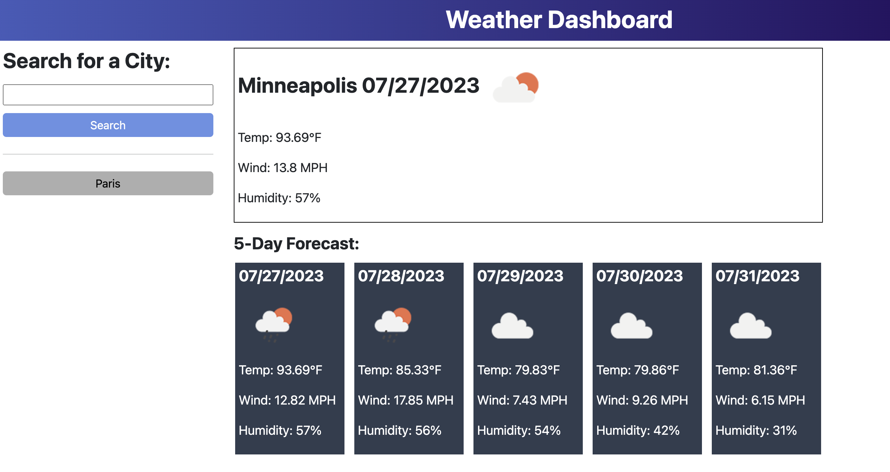

# Weather App

## Description

This 'Weather App' allows the user to search for a city and get the current weather information as well as a 5-day forecast. It then saves that search history as a button to allow the user to re-search for that city's information at another time. Through this project, I learned about how to get information from third-party APIs. I learned about making requests and getting responses, how to handle those responses, and practiced creating elements dynamically. In particular, this API has a ton of information that we can access, so the problem-solving of figuring out how to get information from the user and translate that to the API was an exciting challenge. While I am aware that it doesn't function perfectly at this time, I am proud of how much I was able to learn through this project and know that any feedback I receive will help me continue to grow.

## Installation

To use this site, follow the link or copy and paste it into your browser: https://isabellakingson.github.io/weather-app/.

## Usage

To interact with this page, type in the desired city name and hit the search button. The current weather conditions and 5-day forecast for that city will then be displayed.

## Credits

I had a lot of help from my tutor, Alistair Rowden, with figuring out how to add elements dynamically and how to reuse the getForecast function.
I used the OpenWeatherMap API and day.js.